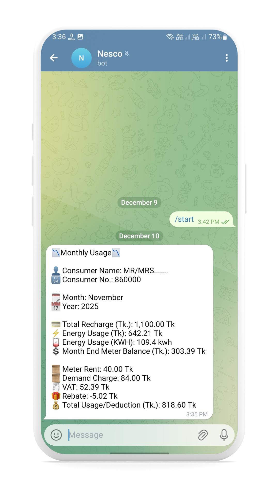

# ⚡ NESCO Prepaid Meter – Monthly Consumption Automation

🔌 NESCO Monthly Consumption Auto Checker Automatically fetches your NESCO monthly electricity consumption and sends updates directly to Telegram and Discord!

---

## 📝 About the Project
This project automatically collects monthly consumption data from your NESCO Prepaid Meter Website and sends clean formatted usage reports directly to Telegram and Discord.

It also supports two languages:

- 🇬🇧 English → main-en.py

- 🇧🇩 Bangla → main-ban.py

---

## 📘 Description
Every month, consumers struggle to manually check their electricity usage.

This script solves that by:

- Fetching consumption data

- Extracting meter rent, VAT, demand charge

- Calculating total usage

- Sending alerts automatically

- Preventing duplicate notifications via a log file

- Running on schedule without user interaction

---
## ✨ Key Features
Dual Language Output
| Language | File          |
| -------- | ------------- |
| English  | `main-en.py`  |
| Bangla   | `main-ban.py` |

Both versions produce:

- Monthly usage summary

- VAT, meter rent, demand charge

- Remaining balance

- Total electricity consumed

---
## 📡 Instant Notifications
- Telegram Bot (bot token + chat id)

- Discord Bot (bot token + channel id)

---


## 🔄 Smart Log System
- Saves old notices to log.json

- Sends only new usage reports

- Prevents repeated messages

---
## 🚀 How to Use
1️⃣ Required Library

- External Libraries (Need to be installed):
   - requests
   - bs4 (from the beautifulsoup4 package)
   - selenium
   - webdriver_manager
   - nest_asyncio
   - discord
```python
pip install requests discord.py beautifulsoup4 selenium webdriver-manager nest-asyncio
```

2️⃣ Clone the Repository
```besh
git clone https://github.com/rezuwan19/Nesco-Prepaid-Meter-Monthly-Consumption.git
cd Nesco-Prepaid-Meter-Monthly-Consumption
```

3️⃣ ⚙️ Configuration
```python
# ---------------------------
# CONFIG FILE (config.py)
# ---------------------------

# Consumer ID for NESCO
CONSUMER_ID = "860000"

# Consumer Name for NESCO
CONSUMER_NAME = "CONSUMER_NAME"

# Telegram Bot (replace with your real token)
TELEGRAM_BOT_TOKEN = "TELEGRAM_BOT_TOKEN"
TELEGRAM_CHAT_ID = "TELEGRAM_CHAT_ID"

# Discord Bot (replace with your real bot token and a numeric channel ID)
# NOTE: Discord bot must be invited to the server and must have permission to send messages in the channel.
DISCORD_BOT_TOKEN = "DISCORD_BOT_TOKEN"
DISCORD_CHANNEL_ID = "DISCORD_CHANNEL_ID"  # numeric channel ID as string or number

# Log file name
LOG_FILE = "log.json"

# Optional: make a short timeout for requests (seconds)
REQUESTS_TIMEOUT = 10

```

4️⃣ Choose Your Message Language
Your repo includes two main scripts:
| Script        | Language               |
| ------------- | ---------------------- |
| `main-en.py`  | English message output |
| `main-ban.py` | Bangla message output  |

✔ If you want English notifications → use main-en.py

✔ If you want Bangla notifications → use main-ban.py

5️⃣ Rename main file

- If you need English message output Rename **main-en.py to main.py**

- If you need Bangla message output Rename **main-ban.py to main.py**
  
6️⃣ Run one of the main files

```python
python main.py
```

---
## 📸 OutPut (Screenshots)

<p align="center" width="100%">
  
  
  
  
</p>

---

## Donate
<a href="https://coff.ee/rezuwan19">
  
</a>
<a href="https://pathaopay.me/@rezuwan19">
  
</a>
---

## GitHub Actions
1️⃣ Create a new repository on GitHub

2️⃣ Upload File
- config.py
- main.py

3️⃣ Add GitHub Actions
- Go to GitHub Actions page
- Click  **set up a workflow yourself**

4️⃣ Add Code
```yml
name: Nesco Monthly Consumption

permissions:
  contents: write

on:
  schedule:
    - cron: "0 6 1,2,3,4,5 * *"  # 12 PM BD 1-5day every month
  workflow_dispatch:

jobs:
  run-script:
    runs-on: ubuntu-latest

    steps:
      - name: Checkout repo
        uses: actions/checkout@v4

      - name: Setup Python
        uses: actions/setup-python@v5
        with:
          python-version: "3.10"

      - name: Install dependencies
        run: |
          pip install --upgrade pip
          pip install webdriver-manager selenium beautifulsoup4 discord.py requests nest_asyncio

      - name: Run main script
        env:
          CONSUMER_ID: ${{ secrets.CONSUMER_ID }}
          TELEGRAM_BOT_TOKEN: ${{ secrets.TELEGRAM_BOT_TOKEN }}
          TELEGRAM_CHAT_ID: ${{ secrets.TELEGRAM_CHAT_ID }}
          DISCORD_BOT_TOKEN: ${{ secrets.DISCORD_BOT_TOKEN }}
          DISCORD_CHANNEL_ID: ${{ secrets.DISCORD_CHANNEL_ID }}
        run: python main.py

      - name: Commit log file
        run: |
          git config --global user.email "github-actions@github.com"
          git config --global user.name "github-actions"
          git pull --rebase origin ${{ github.ref_name }} || true

          if [ -f "log.json" ]; then
            git add log.json
            git commit -m "Update log file" || echo "No changes"
            git push origin ${{ github.ref_name }} || echo "Push failed"
          else
            echo "log.json not found"
          fi
```

5️⃣ Save GitHub Actions
- Click Commit changes
- Again Click Commit changes
GitHub Actions add Successfully.

This GitHub Ac executes monthly, specifically between the 1st and 5th day of the month, at 12:00 PM (noon).
